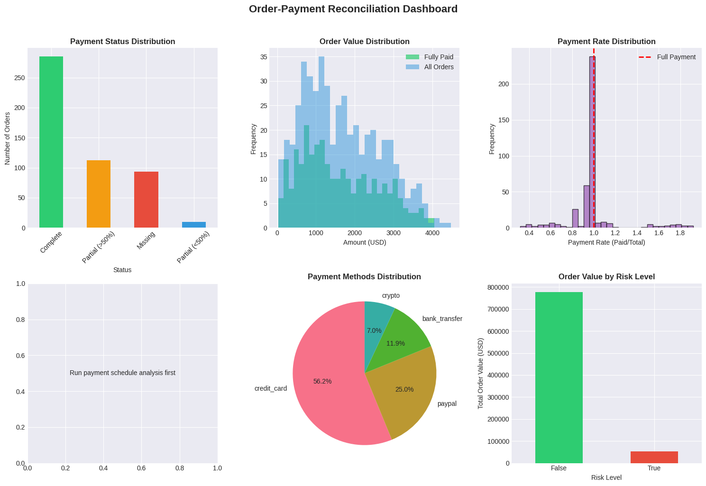

markdown
# Order-Payment Reconciliation System

[](https://python.org)
[](LICENSE)
[](https://github.com/psf/black)

A comprehensive data reconciliation system for e-commerce order and payment validation. This project demonstrates real-world data reconciliation techniques, handling complex scenarios like partial payments, overpayments, duplicates, currency conversion, and data quality issues.



## Table of Contents

- [Overview](#overview)
- [Features](#features)
- [Project Structure](#project-structure)
- [Installation](#installation)
- [Quick Start](#quick-start)
- [Data Generation](#data-generation)
- [Reconciliation Logic](#reconciliation-logic)
- [Visualization](#visualization)
- [Output Examples](#output-examples)
- [Contributing](#contributing)
- [License](#license)

## Overview

This project simulates a real-world e-commerce reconciliation system where orders from an Order Management System (OMS) need to be matched with payments from a Payment Gateway. It handles various edge cases and data quality issues commonly found in production systems.

### Business Use Case
- **Finance teams** need to reconcile daily transactions
- **Auditors** verify payment completeness
- **Operations** identifies payment anomalies
- **Customer Support** resolves payment disputes

## Features

### Core Capabilities
- **Synthetic Data Generation** - Creates realistic orders and payments with intentional discrepancies
- **Basic Reconciliation** - Matches orders with payments and identifies mismatches
- **Advanced Reconciliation** - Handles currency conversion, duplicates, and partial payments
- **Risk Detection** - Flags high-risk transactions and anomalies
- **Interactive Dashboard** - Visual insights into payment patterns
- **Export Reports** - CSV reports for further analysis

### Handling Complex Scenarios
- Partial payments and installments
- Multi-currency transactions (USD/EUR)
- Payment timing analysis
- Duplicate payment detection
- Payment method analytics
- Data quality issue detection

## Project Structure
order_payment_reconciliation/
│
├── data/
│ ├── raw/ # Generated raw data
│ │ ├── orders.csv
│ │ └── payments.csv
│ └── processed/ # Reconciliation results
│ ├── reconciliation_basic.csv
│ └── reconciliation_advanced.csv
│
├── notebooks/ # Jupyter notebooks for exploration
│ ├── 01_data_generation.ipynb
│ ├── 02_reconciliation.ipynb
│ ├── 03_advanced_reconciliation.ipynb
│ └── 04_visualization.ipynb
│
├── scripts/ # Python scripts
│ ├── generate_data.py # Data generation
│ ├── reconcile_basic.py # Basic reconciliation
│ ├── advanced_reconcile.py # Advanced reconciliation
│ └── visualize_results.py # Dashboard creation
│
├── outputs/ # Generated outputs
│ ├── reports/ # CSV reports
│ │ ├── basic_summary.csv
│ │ ├── advanced_summary.csv
│ │ ├── duplicate_payments.csv
│ │ └── payment_schedule.csv
│ └── visualizations/ # Charts and dashboards
│ └── reconciliation_dashboard.png
│
│
├── requirements.txt # Python dependencies
├── README.md # This file
└── .gitignore # Git ignore file

text

## Installation

### Prerequisites
- Python 3.8 or higher
- pip package manager
- (Optional) Virtual environment tool

### Step 1: Clone the Repository

```bash
git clone https://github.com/yourusername/order-payment-reconciliation.git
cd order-payment-reconciliation
Step 2: Create Virtual Environment
Windows:

bash
python -m venv venv
venv\Scripts\activate
macOS/Linux:

bash
python3 -m venv venv
source venv/bin/activate
Step 3: Install Dependencies
bash
pip install --upgrade pip
pip install -r requirements.txt
Note: If you encounter installation issues, install packages sequentially:

bash
pip install numpy==1.24.3
pip install pandas==2.1.0
pip install matplotlib==3.7.2
pip install seaborn==0.13.0
pip install openpyxl==3.1.2
pip install Faker==20.0.0
Step 4: Verify Installation
bash
python -c "import pandas; print(f'Pandas version: {pandas.__version__}')"
🏃 Quick Start
Run the complete pipeline with these commands:

bash
# 1. Create necessary directories
mkdir -p data/raw data/processed outputs/reports outputs/visualizations

# 2. Generate synthetic data
python scripts/generate_data.py

# 3. Run basic reconciliation
python scripts/reconcile_basic.py

# 4. Run advanced reconciliation
python scripts/reconcile_advanced.py

# 5. Create visualizations
python scripts/visualize_results.py
Expected Output
After running, you'll see:

## Expected Output
- Console output showing reconciliation statistics
- CSV files in data/processed/ and outputs/reports/
- Dashboard image in outputs/visualizations/

## Data Generation
The generate_data.py script creates realistic datasets with:

## Orders Data (500 records)
- Order IDs with sequential numbering
- Realistic customer IDs (UUID format)
- Order dates spanning 90 days
- Multiple line items with tax and shipping
- Status tracking (pending, completed, shipped, cancelled, refunded)
- Dual currency support (USD/EUR)

## Payments Data (varies)
1. Multiple payment methods (credit card, PayPal, bank transfer, crypto)
2. Transaction status (success, pending, failed)
3. Intentional discrepancies:
- 80% full payments
- 10% partial payments
- 5% overpayments
- 5% missing payments

4. Duplicate payments (8% of orders)
5. Currency conversion edge cases
6. Data quality issues (nulls, negative amounts, future dates)

## Reconciliation Logic

## Basic Reconciliation
1. Matches orders with payments
2. Calculates payment totals per order
3. Classifies orders into:
- Fully Paid
- Underpaid
- Overpaid
- No Payment

## Advanced Reconciliation Features

1.Currency Standardization

- Converts all payments to USD using exchange rates

- Handles multi-currency transactions

2. Duplicate Detection

- Identifies potential duplicate payments within time windows

- Flags transactions with similar amounts

3. Payment Schedule Analysis

- Calculates days to first payment

- Analyzes payment patterns

- Identifies installment payments

4. Risk Assessment

- Flags orders with multiple payments

- Identifies significant overpayments

- Detects unusual payment patterns

5. Data Quality Checks

- Validates payment dates

- Filters failed transactions

- Handles null values

## Visualization
The dashboard includes six interactive plots:

1. Payment Status Distribution - Bar chart of reconciliation statuses

2. Order Value Distribution - Histogram comparing paid vs. all orders

3. Payment Rate Analysis - Distribution of payment completeness

4. Payment Timing Analysis - Days to first payment histogram

5. Payment Methods - Pie chart of payment method usage

6. Risk Analysis - Order value by risk level

## Output Examples
- Basic Summary Report

Total Orders: 500
Total Order Value: $45,231.50
Total Payments Received: $43,120.75
Orders Fully Paid: 380
Orders Underpaid: 85
Orders Overpaid: 20
Orders No Payment: 15

Sample Reconciliation Results
order_id	total_amount	total_paid	difference	status	high_risk
ORD-00001	$150.00	$150.00	$0.00	Fully Paid	False
ORD-00002	$75.50	$50.00	$25.50	Underpaid	False
ORD-00003	$200.00	$210.00	-$10.00	Overpaid	True

## Contributing
- Contributions are welcome! Here's how you can help:

Fork the repository
Create a feature branch (git checkout -b feature/AmazingFeature)
Commit changes (git commit -m 'Add AmazingFeature')
Push to branch (git push origin feature/AmazingFeature)
Open a Pull Request

## License
- This project is licensed under the MIT License - see the LICENSE file for details.

## Acknowledgments
- Faker library for realistic data generation
- Pandas team for data manipulation tools
- Matplotlib/Seaborn for visualization capabilities


- Project Link: https://github.com/vincentius474/order-payment-reconciliation

## Show Your Support
- If this project helped you, please give it a star ⭐ on GitHub!

## Additional Resources
- Pandas Documentation (https://pandas.pydata.org/docs/)
- Data Reconciliation Best Practices (https://example.com/)
- Python Virtual Environments Guide (https://realpython.com/python-virtual-environments-a-primer/)